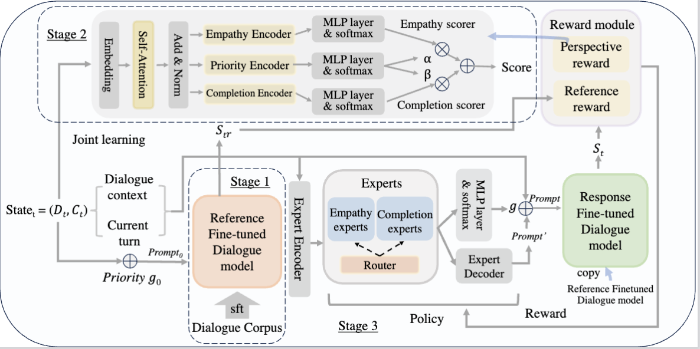
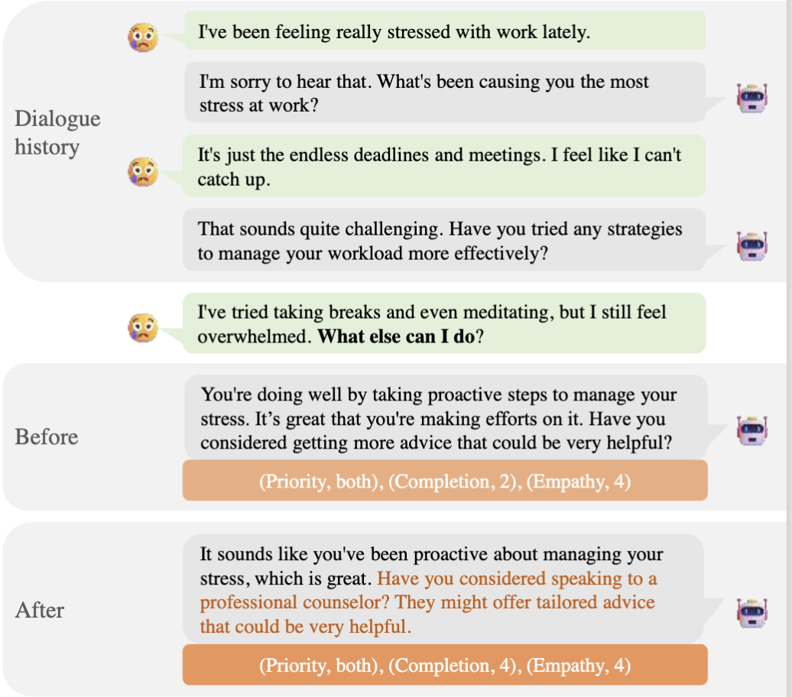

The project for paper "Dialogue Systems Need more Attention on Empathy: A Novel Dataset and Reinforcement Learning Framework for Enhancing Dialogues with Empathy and Completion"

# Model Framework

# Dialogue smaple

## repository framework
    —————  examples: some config files and examples
    —————  scripts: some utils python file releated to the process of training model 
    —————  tests: python files used to evaluate model
    —————  trl: the project we used to train model. 